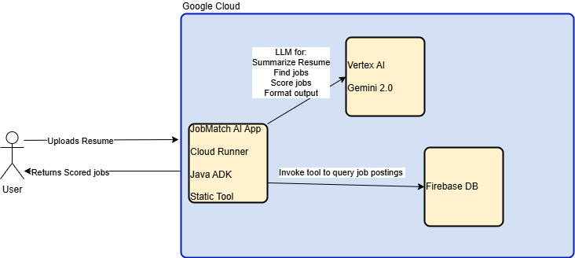

# ResumeMatcher

ResumeMatcher is a project developed for the [Devpost Google Hackathon](https://googlecloudmultiagents.devpost.com/?_gl=1*m1pcd8*_ga*NjQ0Nzc3NjIxLjE3NTAxNTU4MjU.*_ga_0YHJK3Y10M*czE3NTAyMTk4NTYkbzEkZzEkdDE3NTAyMTk5ODQkajYwJGwwJGgw). It is a web application that allows users to submit their resumes and receive job recommendations tailored to their skills and aspirations.

You can view the live project at: [https://devpost-google-hackathon.rutana.dev/](https://devpost-google-hackathon.rutana.dev/)

## Features
- **Submit a Resume**: Upload your resume (e.g., `resume.txt`) or optionally include your career aspirations.
- **Job Matching**: Get scored job recommendations that align with your profile.

## Technologies Used
- **Java**: Core programming language for the backend.
- **Spring Boot**: Framework for building the RESTful web service.
- **Java ADK**: Used for advanced development capabilities.
- **Firebase**: Backend-as-a-service for authentication and data storage.
- **Google Cloud Run**: Managed service for hosting the application.

## Architecture Overview

## How to Use
1. Visit the live application at [https://devpost-google-hackathon.rutana.dev/](https://devpost-google-hackathon.rutana.dev/).
2. Submit your resume or use the example resume provided in `resume.txt`.
3. Optionally, add your career aspirations.
4. Receive a list of jobs scored and matched to your profile.

## Contribution
This project was created as part of the Google Hackathon to demonstrate the use of Google Cloud services and advanced Java development techniques.
